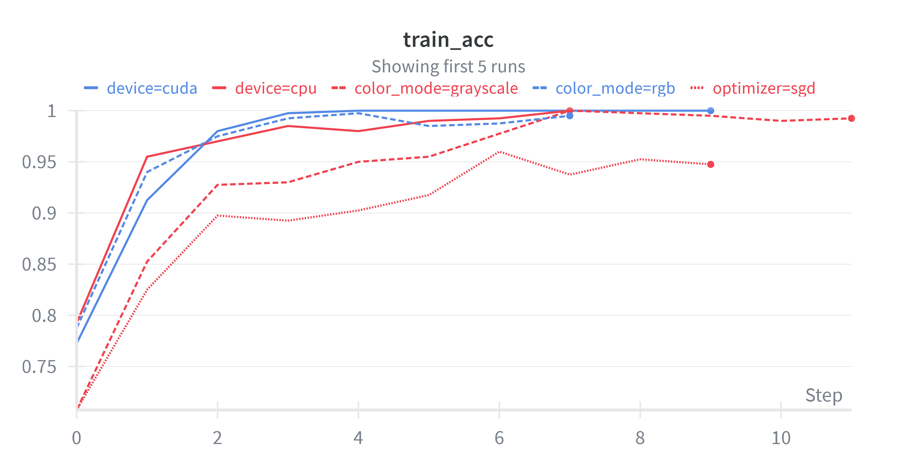
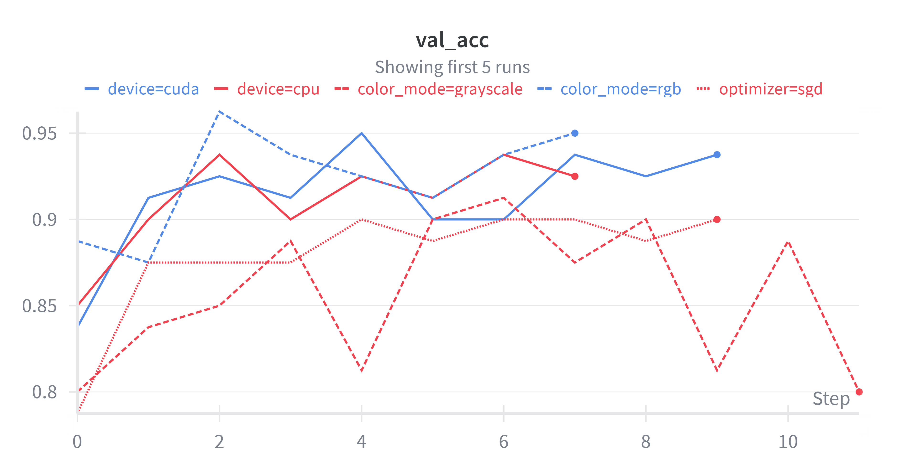
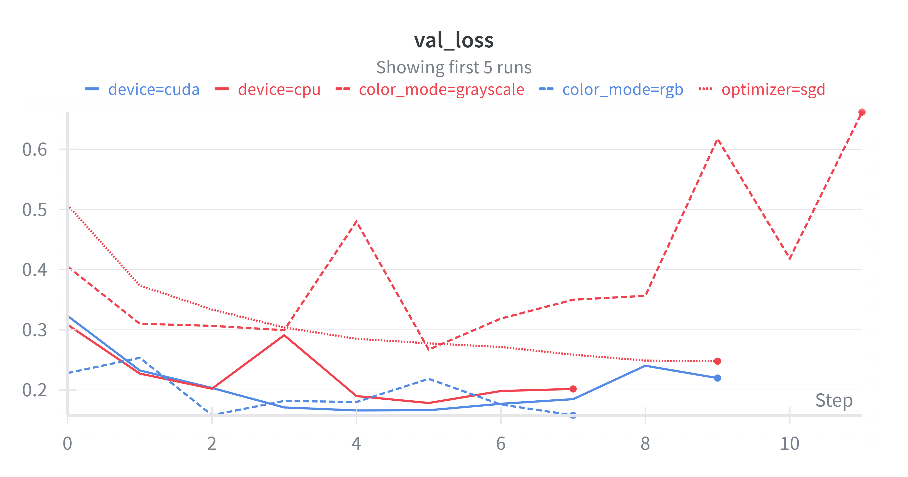
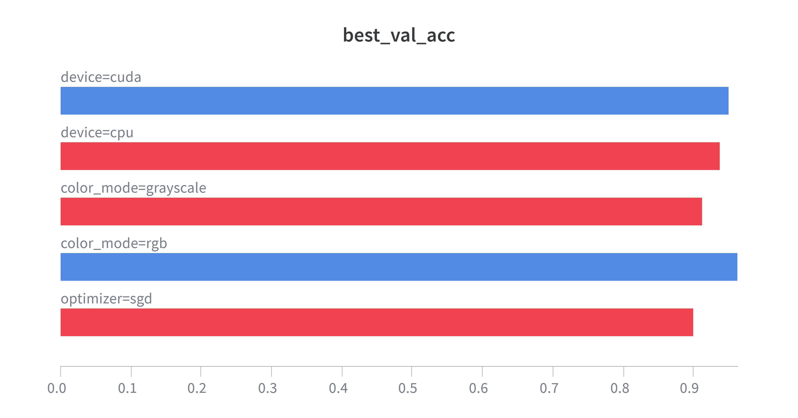
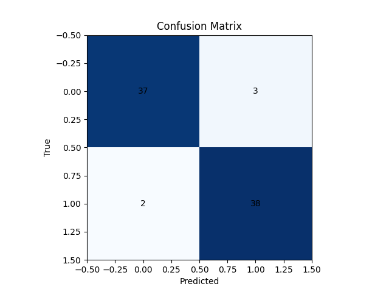

# Visualizations & Results

This section presents the key performance metrics and plots from training and evaluating the AlexNet-based dog emotion classifier. Each visualization is followed by a clear interpretation explaining what the results indicate about the model’s behavior, stability, and generalization.

---

## 🟦 Training Accuracy

Training accuracy rises rapidly across all configurations, reaching approximately **98–100%** within just a few epochs.

**Key Observations:**
- **CUDA-accelerated runs** converge the fastest and most smoothly.
- **Adam** provides more stable learning curves than **SGD**.
- **RGB models** outperform grayscale in early learning and final accuracy.
- Grayscale + SGD shows noticeably slower convergence and lower ceilings.

**Interpretation:**  
AlexNet learns the training data extremely efficiently. Dog facial/body expression features are highly learnable, and the network quickly captures meaningful emotional cues.

---

## 🟥 Validation Accuracy

Validation accuracy remains high and stable across most runs, typically between **90–96%**.

**Key Observations:**
- CUDA + RGB runs produce the **highest validation accuracy**.
- CPU-based runs perform adequately but are more volatile.
- Grayscale models and SGD optimization introduce **greater fluctuation** and slightly lower peaks.

**Interpretation:**  
The model generalizes well to unseen images. Hyperparameter choices (especially optimizer and color mode) significantly impact stability and peak validation performance.

---

## 🟩 Validation Loss

Validation loss trends downward across most runs, confirming that the model is not simply memorizing the training data.

**Key Observations:**
- **Adam + CUDA + RGB** yields the smoothest and lowest validation loss curves.
- **SGD + grayscale** configurations show notable instability and periodic spikes.
- Lower learning rates (0.0001) tend to produce **more controlled, consistent validation loss**.

**Interpretation:**  
The model maintains strong generalization without severe overfitting. Loss patterns reinforce that color information and stable optimization methods improve emotional cue recognition.

---

## 🟪 Hyperparameter Comparison (Best Validation Performance)

This comparison highlights which hyperparameters produced the strongest models.

**Key Findings:**
- **CUDA** consistently outperforms CPU-based training.
- **RGB images** significantly outperform grayscale.
- **Adam > SGD** for both stability and peak accuracy.
- A **lower learning rate (0.0001)** produces better performance across runs.
- Batch size differences are smaller, though **batch_size=16** slightly outperforms larger batches.

**Interpretation:**  
Model performance is strongly influenced by optimizer, color channels, and compute device. The best-performing configuration was **CUDA + RGB + Adam + LR = 0.0001**, indicating this combination is most effective at capturing subtle dog emotion cues.

---

## 🟦 Confusion Matrix

**Matrix Breakdown:**
- Class 0: **37 correct**, **3 incorrect**
- Class 1: **38 correct**, **2 incorrect**

**Interpretation:**
- The classifier performs **nearly equally well** on both classes.
- Only **5 total misclassifications** out of 80 predictions.
- No evidence of class imbalance or bias.
- Errors likely stem from ambiguous facial expressions, occlusions, or borderline emotional states.

---

# ⭐ Overall Results Summary

AlexNet demonstrated strong performance on the task of classifying dog emotional states from images. Training accuracy quickly approached perfection, and validation accuracy consistently reached **94–96%** under optimal settings. 

Hyperparameter exploration revealed:

- **CUDA acceleration** significantly boosts performance and stability.  
- **RGB input** is far more informative than grayscale for emotional cue extraction.  
- The **Adam optimizer** consistently outperforms SGD.  
- **Lower learning rates** yield more stable training and improved validation results.  

The confusion matrix confirms **high precision and balanced performance across classes**, with only a few misclassifications. These results strongly support the feasibility of using AlexNet-based models as a foundational tool for automated dog emotion detection.

---

*End of Results Section*
